# Arquitectura del Sistema - Diagrama de Flujo de Datos

## Flujo General de Datos

```mermaid
flowchart TB
    subgraph UI["🖥️ UI Components"]
        CV[CensusView]
        CT[CensusTable]
        NS[NurseSelector]
        TS[TensSelector]
        DS[DischargesSection]
    end

    subgraph Contexts["📦 Context Providers"]
        DRC[DailyRecordContext]
        SC[StaffContext]
        CAC[CensusActionsContext]
    end

    subgraph Hooks["🪝 Custom Hooks"]
        UDR[useDailyRecord]
        UDRS[useDailyRecordSync]
        UNM[useNurseManagement]
    end

    subgraph Repository["📚 Repository Layer"]
        DRR[DailyRecordRepository]
        CR[CatalogRepository]
    end

    subgraph Storage["💾 Storage Layer"]
        LS[localStorage]
        IDB[(IndexedDB)]
        FS[(Firestore)]
    end

    CV --> DRC
    CV --> SC
    CT --> CAC
    NS --> SC
    TS --> SC

    DRC --> UDR
    SC --> CR

    UDR --> UDRS
    UDR --> UNM

    UDRS --> DRR
    UNM --> DRR

    DRR --> LS
    DRR --> FS
    CR --> LS
    CR --> FS

    LS -.->|migration| IDB
```

---

## Flujo de Sincronización en Tiempo Real

---

## Estructura de Capas

---

## Flujo de Catálogos (Enfermeras/TENS)

---

## Error Boundaries

---

## Archivos Clave por Capa

| Capa | Archivos |
|------|----------|
| **Views** | `CensusView.tsx`, `AnalyticsView.tsx` |
| **Contexts** | `DailyRecordContext.tsx`, `StaffContext.tsx` |
| **Hooks** | `useDailyRecord.ts`, `useDailyRecordSync.ts` |
| **Repositories** | `DailyRecordRepository.ts` (incluye CatalogRepository) |
| **Services** | `firestoreService.ts`, `localStorageService.ts` |
| **Storage** | localStorage, IndexedDB (Dexie), Firestore |
