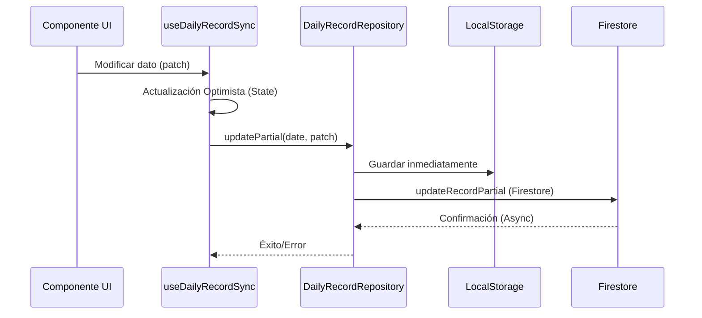

# Arquitectura de Datos y Sincronización

Este documento detalla cómo fluyen los datos en el Sistema de Gestión de Hospitalización HHR, enfocándose en la sincronización entre el cliente (LocalStorage) y la nube (Firestore).

## 1. Niveles de Persistencia

El sistema utiliza tres niveles de persistencia para garantizar la disponibilidad y el rendimiento:

1.  **Estado Reactivo (React Context/Hooks)**: Sincronización inmediata en la UI.
2.  **Capa Local (LocalStorage/IndexedDB)**: Persistencia persistente en el dispositivo del usuario. Permite trabajo offline y carga instantánea.
3.  **Capa Nube (Firestore)**: Fuente de verdad compartida para colaboración multi-usuario y respaldo centralizado.

## 2. Flujo de Escritura (Optimistic UI)

Cuando un usuario modifica un campo (ej. nombre de un paciente):

## 3. Estrategia de Sincronización (Echo Protection)

Para evitar el efecto "rubber-banding" (el cursor salta porque llega una actualización remota de lo que el usuario acaba de escribir), el sistema implementa:

*   **hasPendingWrites**: El hook `useDailyRecordSync` ignora actualizaciones de Firestore si sabe que hay escrituras locales en curso.
*   **Debouncing**: Los campos de texto (`DebouncedTextarea`) esperan a que el usuario deje de escribir antes de enviar el patch a Firestore.
*   **Timestamp Check**: Al reconectar, el sistema compara `lastUpdated` entre Local y Cloud para decidir cuál versión prevalece.

## 4. Gestión de Personal (Single Source of Truth)

> [!IMPORTANT]
> El Censo Diario es la **Única Fuente de Verdad** para el personal de turno.

*   Los nombres de Enfermeros y TENS se guardan en el `DailyRecord`.
*   La vista de **Entrega de Turno (Handoff)** consume estos datos directamente.
*   **NO** se debe guardar personal en colecciones separadas para evitar inconsistencias por desfase de fechas.

## 5. Modo Offline

En caso de pérdida de conexión:
1.  El sistema detecta el estado `navigator.onLine = false`.
2.  Las escrituras continúan en `LocalStorage`.
3.  Se muestra un indicador de `OFFLINE` al usuario.
4.  Al recuperar la conexión, el sistema realiza un "Deep Sync" comparando versiones.
